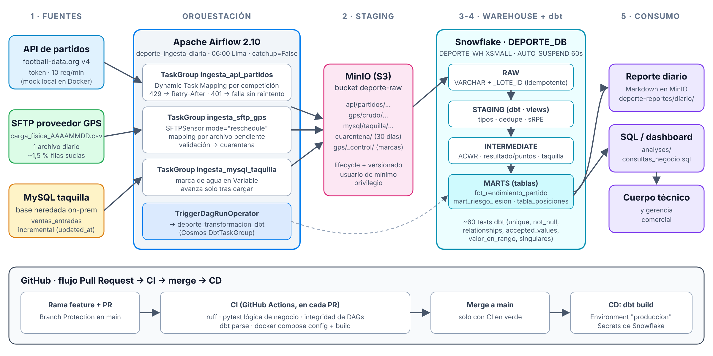
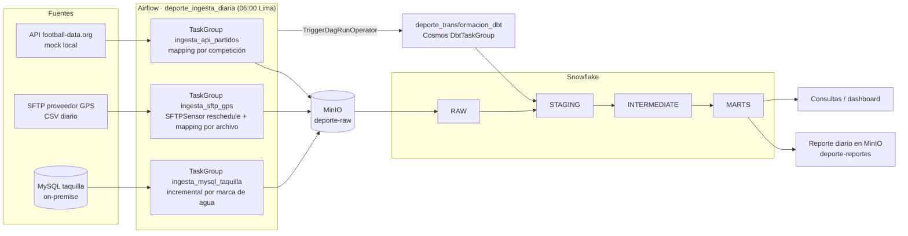

# ⚽ DeporData — Pipeline de datos del Club Deportivo SQ

Proyecto Final Integrador · PEDE/9 · Apache Airflow

> **En 2 minutos:** el Club Deportivo SQ quiere saber cada mañana **si el
> plantel llega en condiciones a los partidos, si eso se traduce en resultados y
> cuánto recauda en taquilla**. Hoy esos datos están en tres lugares que no se
> hablan: una **API de resultados de fútbol**, los **archivos CSV de los
> chalecos GPS** que el proveedor deja en un SFTP, y la **base MySQL heredada
> de taquilla**. DeporData los junta todos los días con Apache Airflow, los
> respalda en MinIO, los carga en Snowflake y los transforma con dbt en tres
> tablas listas para usar: rendimiento por partido, semáforo de riesgo de
> lesión de cada jugador y tabla de posiciones de la liga.



---

## Contenido

1. [Fuentes de datos](#1-fuentes-de-datos)
2. [Arquitectura y flujo](#2-arquitectura-y-flujo)
3. [Levantar el proyecto con Docker](#3-levantar-el-proyecto-con-docker)
4. [Los DAGs](#4-los-dags)
5. [Transformación con dbt](#5-transformación-con-dbt)
6. [Testing y CI/CD](#6-testing-y-cicd)
7. [Seguridad](#7-seguridad)
8. [Glosario de negocio](#8-glosario-de-negocio)
9. [Decisiones de diseño](#9-decisiones-de-diseño)
10. [Mapa de requisitos del enunciado](#10-mapa-de-requisitos-del-enunciado)
11. [Estructura del repositorio](#11-estructura-del-repositorio)
12. [Problemas frecuentes](#12-problemas-frecuentes)

---

## 1. Fuentes de datos

| #   | Fuente                         | Tipo                     | Qué trae                                                                           | Particularidad "del mundo real"                                                                                                          |
| --- | ------------------------------ | ------------------------ | ---------------------------------------------------------------------------------- | ---------------------------------------------------------------------------------------------------------------------------------------- |
| 1   | **API football-data.org v4**   | API REST                 | Partidos de la Liga Andina (`LAN`) y la Copa Andina (`CPA`) con marcador           | Token por cabecera, **límite de 10 peticiones/min (HTTP 429)**, rango máximo de 10 días por consulta, marcadores que se corrigen después |
| 2   | **SFTP del proveedor GPS**     | Archivo CSV diario       | Carga física por jugador y sesión: minutos, distancia, sprints, velocidad, FC, RPE | Llega a hora variable, **~1,5 % de filas con errores** (RPE fuera de escala, distancias negativas, `N/D`)                                |
| 3   | **MySQL heredado de taquilla** | Base de datos on-premise | Venta de entradas por tribuna y canal                                              | Sin API: hay que leerla **incrementalmente** por `updated_at`; ventas que se **anulan días después**                                     |

Las tres fuentes corren en Docker para que el proyecto funcione en cualquier
máquina. La API es un **mock fiel al contrato de football-data.org**
(`simulators/mock_api/`): el código de ingesta es exactamente el que se usaría
contra la API real (ver [cómo usar la API real](#usar-la-api-real-de-football-dataorg)).
Lo permite la sección 12 del enunciado.

## 2. Arquitectura y flujo



El esqueleto es el mismo que pide la sección 6 del enunciado:

1. **Ingesta** — Airflow trae datos de tres fuentes, con sensor y manejo de errores.
2. **Staging intermedio** — todo pasa por MinIO (`s3://deporte-raw/…`) antes de Snowflake: respaldo y trazabilidad.
3. **Carga al warehouse** — Snowflake `DEPORTE_DB.RAW`, cargas idempotentes por lote.
4. **Transformación** — dbt orquestado con Cosmos: `staging → intermediate → marts`, con tests.
5. **Consumo** — reporte diario en Markdown en `s3://deporte-reportes/diario/…` y consultas SQL de negocio en `dbt/deporte/analyses/`.

## 3. Levantar el proyecto con Docker

### Requisitos

- Docker Desktop (o Docker Engine + Compose v2) con **al menos 6 GB de RAM** asignados.
- Una cuenta de Snowflake.
- Puertos libres: `8080` (Airflow), `9000/9001` (MinIO), `2222` (SFTP), `3306` (MySQL), `8000` (mock API).

### Paso 1 — Preparar Snowflake (una sola vez)

Abrir un worksheet en Snowsight con el rol `ACCOUNTADMIN`, reemplazar
`<CLAVE_SEGURA>` en [`snowflake/01_setup.sql`](snowflake/01_setup.sql) por una
contraseña propia **(sin guardarla en el archivo del repositorio)** y ejecutarlo.
Crea el warehouse `DEPORTE_WH` (XSMALL, `AUTO_SUSPEND = 60`), la base
`DEPORTE_DB` con sus schemas, el rol de mínimo privilegio
`DEPORTE_PIPELINE_ROLE` y el usuario `DEPORTE_PIPELINE_USER`.

### Paso 2 — Variables de entorno

```bash
git clone https://github.com/<usuario>/proyecto-final-integrador-depor.git
cd proyecto-final-integrador-depor
cp .env.example .env
```

Editar `.env` y completar como mínimo:

| Variable                    | Cómo obtenerla                                                                                                                |
| --------------------------- | ----------------------------------------------------------------------------------------------------------------------------- |
| `AIRFLOW__CORE__FERNET_KEY` | `python -c "from cryptography.fernet import Fernet; print(Fernet.generate_key().decode())"` (o cualquier clave Fernet válida) |
| `SNOWFLAKE_ACCOUNT`         | Identificador de la cuenta, formato `ORGNAME-ACCOUNTNAME` (Snowsight → Admin → Accounts)                                      |
| `SNOWFLAKE_PASSWORD`        | La contraseña que pusiste en el paso 1                                                                                        |
| Las demás `*_PASSWORD`      | Cualquier clave local (no usar comillas dobles `"` ni `\`)                                                                    |

En Linux, poner además en `AIRFLOW_UID` el resultado de `id -u` para que los logs tengan tu usuario.

> `.env` está en `.gitignore`: **nunca** se sube al repositorio.

### Paso 3 — Levantar todo

```bash
docker compose up -d --build
```

La primera vez tarda unos minutos (construye la imagen de Airflow con Cosmos y
dbt). Para verificar que todo quedó sano:

```bash
docker compose ps
```

`airflow-init` y `minio-init` deben terminar con `Exited (0)`; el resto, `Up`
(`healthy` donde aplica).

| Servicio      | URL / acceso                         | Usuario                                                    |
| ------------- | ------------------------------------ | ---------------------------------------------------------- |
| Airflow       | http://localhost:8080                | `AIRFLOW_ADMIN_USER` / `AIRFLOW_ADMIN_PASSWORD` del `.env` |
| Consola MinIO | http://localhost:9001                | `MINIO_ROOT_USER` / `MINIO_ROOT_PASSWORD`                  |
| Mock API      | http://localhost:8000/health         | —                                                          |
| SFTP          | `sftp -P 2222 rendimiento@localhost` | `SFTP_USER` / `SFTP_PASSWORD`                              |
| MySQL         | `localhost:3306`, base `taquilla`    | `MYSQL_READER_USER` (solo lectura)                         |

### Paso 4 — Ejecutar el pipeline

1. En Airflow, activar (unpause) **`deporte_ingesta_diaria`** y **`deporte_transformacion_dbt`**.
2. Disparar `deporte_ingesta_diaria` con ▶ _Trigger DAG_. La primera corrida
   carga toda la historia disponible (42 días de archivos GPS, 6 semanas de
   partidos y todas las ventas de taquilla).
3. Al terminar, la ingesta dispara sola `deporte_transformacion_dbt`, que
   ejecuta los modelos y tests de dbt y publica el reporte.
4. Resultados:
   - En Snowflake: `select * from DEPORTE_DB.MARTS.FCT_RENDIMIENTO_PARTIDO;`
   - En MinIO: bucket `deporte-reportes` → `diario/fecha=…/reporte.md`.
   - Consultas de negocio de ejemplo: [`dbt/deporte/analyses/consultas_negocio.sql`](dbt/deporte/analyses/consultas_negocio.sql).

Después de eso el DAG corre solo todos los días a las 06:00 (hora de Lima).

### Configuración opcional (Variable `deporte_config`)

Sin crear nada, el pipeline usa valores por defecto. Para cambiarlos: _Admin →
Variables → +_, clave `deporte_config`, valor JSON, por ejemplo:

```json
{
  "competiciones": ["LAN", "CPA"],
  "dias_ventana_api": 70,
  "umbral_filas_invalidas": 0.05
}
```

| Clave                      | Default          | Para qué                                                                                                                            |
| -------------------------- | ---------------- | ----------------------------------------------------------------------------------------------------------------------------------- |
| `competiciones`            | `["LAN", "CPA"]` | Una tarea mapeada por competición                                                                                                   |
| `dias_ventana_api`         | `42`             | Ventana re-extraída en cada corrida (subirla a 70 en la primera corrida trae la temporada completa; verás el manejo del límite 429) |
| `max_archivos_por_corrida` | `60`             | Tope de archivos GPS por corrida (backfill controlado)                                                                              |
| `umbral_filas_invalidas`   | `0.05`           | Más de este % de filas malas (y más de 2) detiene la carga del archivo                                                              |

La configuración se valida al inicio (`leer_configuracion`): un JSON inválido
falla con un mensaje claro y sin reintentos.

### Usar la API real de football-data.org

1. Crear una cuenta gratuita en https://www.football-data.org/ y copiar el token.
2. En `.env`: `FOOTBALL_API_HOST=https://api.football-data.org` y `FOOTBALL_API_TOKEN=<tu token>`.
3. Variable `deporte_config`: `{"competiciones": ["PL", "PD"]}` (u otras del plan gratuito).
4. `docker compose up -d` para recargar las Connections.

El código no cambia: la diferencia es solo la Connection. (Los archivos GPS y
la taquilla seguirán siendo del club simulado.)

### Apagar

```bash
docker compose down        # conserva datos
docker compose down -v     # borra también volúmenes (MinIO, MySQL, metadatos)
```

## 4. Los DAGs

### `deporte_ingesta_diaria` (productivo)

- `schedule="0 6 * * *"` en zona `America/Lima`, `catchup=False`, `max_active_runs=1`.
- `doc_md` con el propósito, `owner` en todas las tareas (`equipo_datos_deporte`, `analitica_deportiva`, `rendimiento_fisico`, `gerencia_comercial`).
- **Reintentos con criterio:** 3 reintentos con backoff exponencial (2 → 4 → 8 min, tope 20) para fallos transitorios de fuentes externas; **0 reintentos** para validar la configuración y para el sensor (su timeout de 6 h ya es la tolerancia).

```
leer_configuracion → preparar_tablas_raw ─┬─ ingesta_api_partidos:   listar_competiciones → extraer_partidos[LAN, CPA] → cargar_partidos
                                          ├─ ingesta_sftp_gps:        esperar_archivo_gps (SFTPSensor, reschedule) → listar_pendientes → procesar_archivo_gps[archivo…]
                                          └─ ingesta_mysql_taquilla:  extraer_ventas → cargar_ventas → actualizar_marca_agua
                                                       ↓ (trigger_rule=all_done)
                                     fin_ingesta → disparar_transformacion_dbt → verificar_corrida
```

| Técnica del curso          | Dónde                                                                                                                                                                    |
| -------------------------- | ------------------------------------------------------------------------------------------------------------------------------------------------------------------------ |
| TaskGroups                 | Uno por fuente                                                                                                                                                           |
| Dynamic Task Mapping       | `extraer_partidos` (por competición) y `procesar_archivo_gps` (por archivo pendiente), con `map_index_template` para verlos por nombre en la UI                          |
| Sensor `mode="reschedule"` | `esperar_archivo_gps` (`SFTPSensor`), libera el worker entre chequeos                                                                                                    |
| Trigger rules              | `fin_ingesta` y `disparar_transformacion_dbt` con `ALL_DONE`; `verificar_corrida` con `ALL_DONE` falla la corrida si cualquier tarea falló (el fallo nunca queda oculto) |
| `AirflowSkipException`     | Taquilla sin ventas nuevas → la rama se salta, no falla                                                                                                                  |
| TriggerDagRunOperator      | Encadena con `deporte_transformacion_dbt`                                                                                                                                |
| Variables                  | `deporte_config` (configuración) y `deporte_taquilla_marca_agua` (estado incremental)                                                                                    |
| Connections                | `football_api`, `sftp_rendimiento`, `mysql_taquilla`, `minio_deporte`, `snowflake_deporte`                                                                               |
| XComs                      | Claves de MinIO y la nueva marca de agua viajan entre tareas (nunca los datos en sí)                                                                                     |
| Observabilidad             | `on_failure_callback` con alerta estructurada (punto de enganche para Slack/Teams)                                                                                       |

**Manejo explícito de errores** (`include/deporte/errores.py`): la lógica de
negocio lanza errores tipados y el DAG los traduce a la semántica de Airflow.

| Situación                              | Error                                                                    | Qué hace Airflow                                                              |
| -------------------------------------- | ------------------------------------------------------------------------ | ----------------------------------------------------------------------------- |
| API responde 429                       | se respeta `Retry-After` (hasta 3 veces); si persiste, `ErrorLimiteTasa` | reintenta con backoff                                                         |
| API responde 5xx / timeout             | `ErrorServidorApi` / excepción de red                                    | reintenta con backoff                                                         |
| Token inválido (401/403)               | `ErrorCredenciales`                                                      | **falla sin reintentar** (`AirflowFailException`)                             |
| La respuesta cambia de formato         | `ErrorEsquemaApi`                                                        | falla sin reintentar                                                          |
| Archivo GPS con demasiadas filas malas | `ErrorCalidadDatos`                                                      | falla ese archivo (los demás siguen); queda pendiente para la próxima corrida |
| Filas GPS malas aisladas               | —                                                                        | van a `s3://deporte-raw/cuarentena/` con el motivo, el resto se carga         |

**Idempotencia:** cada carga a Snowflake borra y reinserta su lote (`_LOTE_ID`);
los archivos GPS se marcan como procesados (`gps/_control/cargados/*.ok`) solo
después de cargarse; la marca de agua de taquilla avanza solo después de la
carga. Re-ejecutar una corrida nunca duplica datos.

### `deporte_transformacion_dbt`

- `DbtTaskGroup` de **Astronomer Cosmos** con `ProjectConfig`, `ProfileConfig` (`profiles.yml` con `env_var()`) y `ExecutionConfig` (dbt en un virtualenv aislado dentro de la imagen).
- Cada seed/modelo es una tarea de Airflow seguida de sus tests (`TestBehavior.AFTER_EACH`); los tests que cruzan varios modelos se ejecutan como tareas propias.
- `generar_reporte_diario` consulta los marts y publica el reporte en MinIO.

## 5. Transformación con dbt

Proyecto en [`dbt/deporte`](dbt/deporte). Linaje:

```
seeds: jugadores, tribunas
RAW.API_PARTIDOS      → stg_api__partidos     → int_partidos_club ─────────┐
                                              └→ mart_tabla_posiciones      │
RAW.GPS_CARGA_FISICA  → stg_gps__carga_fisica → int_carga_diaria_jugador ──┼→ fct_rendimiento_partido
                                                └→ mart_riesgo_lesion      │
RAW.TAQUILLA_VENTAS   → stg_taquilla__ventas  → int_taquilla_por_partido ──┘
```

| Capa           | Materialización | Lógica de negocio                                                                                                                                                                      |
| -------------- | --------------- | -------------------------------------------------------------------------------------------------------------------------------------------------------------------------------------- |
| `staging`      | vistas          | Tipado desde VARCHAR, deduplicación (la API se re-extrae, las ventas cambian de estado), carga interna sRPE = RPE × minutos                                                            |
| `intermediate` | vistas          | Resultado y puntos desde la perspectiva del club; **serie diaria continua por jugador y ACWR** (carga aguda 7d / crónica 28d) con nivel de riesgo; ocupación y recaudación por partido |
| `marts`        | tablas          | `fct_rendimiento_partido` (cruza las 3 fuentes), `mart_riesgo_lesion` (semáforo con recomendación), `mart_tabla_posiciones`, `dim_jugadores`                                           |

**Tests (~60):** `unique`, `not_null`, `relationships` (todo jugador del GPS
existe en el plantel; toda tribuna vendida existe), `accepted_values`, dos tests
genéricos propios (`valor_en_rango`, `combinacion_unica`) y tres tests
singulares de reglas de negocio (puntos coherentes con el marcador, ventas que
no superan el aforo de la tribuna, tabla de posiciones que cuadra). Algunos usan
`severity: warn` donde avisar es mejor que bloquear (p. ej. una competición
nueva en la Variable).

Otros elementos: `generate_schema_name` para escribir en `STAGING`,
`INTERMEDIATE`, `MARTS`, `SEEDS`; glosario en _docs blocks_
(`models/glosario.md`); `exposures` con los consumidores (reporte y
dashboard), visibles en el linaje de `dbt docs`; `meta.owner` en cada modelo.

Ejecutar dbt a mano dentro del contenedor:

```bash
docker compose exec airflow-scheduler bash -c \
  "cd /tmp && cp -r /opt/airflow/dbt/deporte p && cd p && /opt/airflow/dbt_venv/bin/dbt build --profiles-dir ."
```

## 6. Testing y CI/CD

| Nivel              | Qué prueba                                                                                                                                                                                                                                                                    | Dónde                    |
| ------------------ | ----------------------------------------------------------------------------------------------------------------------------------------------------------------------------------------------------------------------------------------------------------------------------- | ------------------------ |
| Unitarios (pytest) | Lógica de negocio pura, sin Airflow: tramos de fechas para la API, reintentos ante 429/401/5xx, validación y cuarentena de filas GPS, regla de calidad, archivos pendientes, consulta incremental parametrizada y marca de agua, cargas idempotentes, configuración y reporte | `tests/unit/` (72 tests) |
| Integridad de DAGs | Importan sin errores, schedule real y `catchup=False`, owners, reintentos, TaskGroups, mapping, sensor en reschedule, encadenamiento, **sin credenciales en el código**                                                                                                       | `tests/dags/`            |
| dbt                | ~60 tests de datos en cada corrida                                                                                                                                                                                                                                            | `dbt/deporte`            |

**GitHub Actions** ([`.github/workflows/ci.yml`](.github/workflows/ci.yml)) en
**cada Pull Request**: ruff (lint + formato), pytest de lógica de negocio,
integridad de DAGs con Airflow 2.10.5 instalado, `dbt parse` y
`docker compose config` + build de la imagen.

**CD** ([`.github/workflows/cd.yml`](.github/workflows/cd.yml)): al mezclar a
`main`, `dbt build` contra Snowflake usando el **Environment `produccion`** y
sus **Secrets**; genera `dbt docs` como artefacto.

La configuración paso a paso de **Branch Protection**, Secrets y Environments
está en [`docs/ci_cd.md`](docs/ci_cd.md).

Correr los tests en local:

```bash
pip install -r requirements-dev.txt
pytest tests/unit -v
ruff check . && ruff format --check .
```

## 7. Seguridad

- **Cero credenciales en el código o en Git.** Todo sale de `.env` (ignorado por Git) y entra a Airflow como **Connections** (`AIRFLOW_CONN_*`); dbt las lee con `env_var()`. Un test de CI busca patrones de secretos en `dags/` e `include/`. Verificación: `git log --all -- .env` no muestra nada.
- **Cada contenedor recibe solo lo que necesita**: Airflow no recibe la clave root de MySQL ni la de MinIO (no se usa `env_file`).
- **Mínimo privilegio** en cada sistema:
  - MySQL: usuario `airflow_lector` con **solo `SELECT`** sobre `taquilla.ventas_entradas`.
  - MinIO: usuario `airflow-deporte` con una política que **solo** permite listar/leer/escribir en `deporte-raw` y `deporte-reportes` (no puede borrar ni crear buckets — verificado).
  - Snowflake: rol `DEPORTE_PIPELINE_ROLE` limitado a `DEPORTE_DB` y `DEPORTE_WH`; rol `DEPORTE_LECTOR_ROLE` de solo lectura para analistas; monitor de recursos que suspende el warehouse.
  - SFTP: Airflow solo lee; no mueve ni borra archivos del proveedor.
- **SQL parametrizado** en la extracción de MySQL (con validación de formato de la marca de agua) y lista blanca de tablas en la carga a Snowflake.
- **Buckets** con versionado y lifecycle policies (cuarentena 30 días, crudos 365 días).
- Nota: la Connection SFTP usa `no_host_key_check` porque el servidor vive en la red privada de Docker; en producción se fijaría la `host_key` del proveedor.

## 8. Glosario de negocio

| Término                  | Definición                                                                                                                                                                              | Owner               |
| ------------------------ | --------------------------------------------------------------------------------------------------------------------------------------------------------------------------------------- | ------------------- |
| **Carga interna (sRPE)** | Esfuerzo percibido por el jugador (RPE, escala 1–10) × minutos de la sesión. Unidades arbitrarias (UA).                                                                                 | Rendimiento físico  |
| **ACWR**                 | _Acute:Chronic Workload Ratio_: promedio de carga de los últimos 7 días ÷ promedio de los últimos 28. Zona óptima 0,8–1,3; > 1,5 = riesgo ALTO de lesión. Requiere 21 días de historia. | Rendimiento físico  |
| **Nivel de riesgo**      | Semáforo derivado del ACWR: `ALTO` (> 1,5), `MODERADO` (1,3–1,5), `OPTIMO` (0,8–1,3), `BAJA_CARGA` (< 0,8), `SIN_HISTORIA`.                                                             | Rendimiento físico  |
| **Resultado / puntos**   | Desde la perspectiva del club: G = ganado (3), E = empatado (1), P = perdido (0).                                                                                                       | Analítica deportiva |
| **Ocupación**            | Entradas pagadas ÷ aforo oficial del estadio (suma de tribunas).                                                                                                                        | Gerencia comercial  |
| **Recaudación neta**     | Σ cantidad × precio de ventas `PAGADA` (las anuladas no suman). Soles.                                                                                                                  | Gerencia comercial  |
| **Marca de agua**        | Último `updated_at` de taquilla ya cargado en Snowflake; la próxima extracción lee solo lo posterior.                                                                                   | Equipo de datos     |
| **Cuarentena**           | Zona de MinIO donde quedan las filas rechazadas con su motivo, para revisarlas con el proveedor.                                                                                        | Equipo de datos     |

El mismo glosario vive en dbt (`dbt/deporte/models/glosario.md`) y aparece en
la documentación de cada columna con `dbt docs`.

## 9. Decisiones de diseño

- **¿Por qué estas fuentes?** Son las tres preguntas reales de un club (¿ganamos?, ¿cómo está el plantel?, ¿cuánto entra?) y cubren los tres tipos de integración del curso: API con límites, archivo por SFTP y base de datos heredada.
- **RAW todo en VARCHAR (schema-on-read).** Si el proveedor cambia un formato, la carga no se rompe: lo detecta un test de dbt, que es donde se ve y se documenta.
- **Re-extraer una ventana de la API** en vez de solo el día: los marcadores se corrigen y los partidos se aplazan. dbt deduplica quedándose con la versión más reciente.
- **Procesar "todos los archivos pendientes"** en vez de solo el del día: si un día falla o el proveedor entrega tarde, la próxima corrida se pone al día sola (y la primera corrida hace el backfill).
- **Batch incremental y no CDC** para taquilla: una corrida diaria basta para el negocio y no exige tocar la base heredada (binlog, permisos de replicación).
- **dbt corre aunque una fuente falle** (`ALL_DONE`): los modelos son idempotentes y los datos de las otras fuentes siguen siendo útiles; el fallo se hace visible con `verificar_corrida` y la alerta.
- **Tests de dbt priorizados**: primero los que protegen el indicador más sensible (riesgo de lesión): `relationships` de jugador, rango del RPE y unicidad de la serie diaria; luego reglas de negocio de puntos y aforo.
- **On-premise vs nube**: la taquilla se queda on-premise (sistema heredado, sin presupuesto para migrarlo) y se lee en batch nocturno; el warehouse va a la nube por elasticidad (XSMALL con `AUTO_SUSPEND`) y Time Travel. En producción Airflow podría ir a un servicio gestionado (MWAA, Cloud Composer o Astronomer); este repositorio corre igual allí porque todo se configura por Connections y variables.

Más detalle en el documento de arquitectura: [`docs/arquitectura.md`](docs/arquitectura.md) (PDF en `docs/arquitectura.pdf`).

## 10. Mapa de requisitos del enunciado

| Requisito (sección 5)                              | Cumplido en                                               |
| -------------------------------------------------- | --------------------------------------------------------- |
| DAG productivo con schedule real y `catchup=False` | `dags/deporte_ingesta_diaria.py`                          |
| TaskGroup                                          | 3 TaskGroups en la ingesta + `DbtTaskGroup`               |
| Sensor (`mode="reschedule"`)                       | `esperar_archivo_gps`                                     |
| `retries` / `retry_delay` con criterio             | `default_args` + overrides por tarea (comentados)         |
| Credenciales en Connections/Variables              | `docker-compose.yaml` (`AIRFLOW_CONN_*`), `.env.example`  |
| Tests pytest de lógica de negocio                  | `tests/unit/`                                             |
| GitHub Actions en cada PR                          | `.github/workflows/ci.yml`                                |
| Branch Protection exigiendo CI                     | `docs/ci_cd.md`                                           |
| ≥ 3 modelos dbt encadenados                        | 10 modelos en 3 capas                                     |
| ≥ 2 tests dbt                                      | ~60 tests                                                 |
| dbt orquestado desde Airflow                       | `dags/deporte_transformacion_dbt.py` (Cosmos)             |
| `profiles.yml` con `env_var()`                     | `dbt/deporte/profiles.yml`                                |
| ≥ 2 fuentes distintas                              | API + SFTP + MySQL                                        |
| Archivo pasa por object storage                    | SFTP → MinIO → Snowflake                                  |
| Manejo explícito de errores                        | `include/deporte/errores.py`, `api_client.py`, cuarentena |
| README con diagrama y Docker                       | este archivo                                              |
| `doc_md` y `owner`                                 | ambos DAGs                                                |
| Glosario                                           | sección 8 + `models/glosario.md`                          |

## 11. Estructura del repositorio

```
├── dags/                         # Solo orquestación (capa delgada)
│   ├── deporte_ingesta_diaria.py
│   └── deporte_transformacion_dbt.py
├── include/
│   ├── deporte/                  # Lógica de negocio en Python puro (testeable sin Airflow)
│   └── sql/raw_tablas.sql        # DDL de la capa RAW
├── dbt/deporte/                  # Proyecto dbt (models, seeds, tests, macros, analyses)
├── tests/
│   ├── unit/                     # pytest de lógica de negocio
│   └── dags/                     # integridad de DAGs
├── simulators/                   # Mock de la API y generador de archivos GPS
├── infra/                        # Init de MySQL (taquilla) y MinIO (buckets, políticas)
├── snowflake/                    # Setup (roles, warehouse) y operación (Time Travel, clones)
├── docs/                         # Arquitectura, CI/CD, guion del video
├── .github/workflows/            # CI y CD
├── Dockerfile                    # Airflow 2.10.5 + Cosmos + dbt en venv
├── docker-compose.yaml
└── .env.example                  # Plantilla (el .env real nunca se sube)
```

## 12. Problemas frecuentes

| Síntoma                                                                        | Solución                                                                                                           |
| ------------------------------------------------------------------------------ | ------------------------------------------------------------------------------------------------------------------ |
| `airflow-init` falla con `Fernet key must be 32 url-safe base64-encoded bytes` | Generar la clave como indica el paso 2                                                                             |
| Tareas de Snowflake fallan con `250001` / `Incorrect username or password`     | Revisar `SNOWFLAKE_ACCOUNT` (formato `ORG-CUENTA`) y que el paso 1 se haya ejecutado; luego `docker compose up -d` |
| `esperar_archivo_gps` queda en _up_for_reschedule_                             | Normal hasta que exista el archivo del día; el generador entrega los días ya terminados cada 5 min                 |
| `extraer_partidos` muestra _429_ en el log                                     | Es el límite de tasa simulado; la tarea espera y reintenta sola                                                    |
| Contenedores reiniciándose / lentitud                                          | Subir la RAM de Docker a 6–8 GB                                                                                    |
| Error de permisos en `./logs` (Linux)                                          | Poner en `AIRFLOW_UID` (archivo `.env`) el resultado de `id -u`                                                    |
